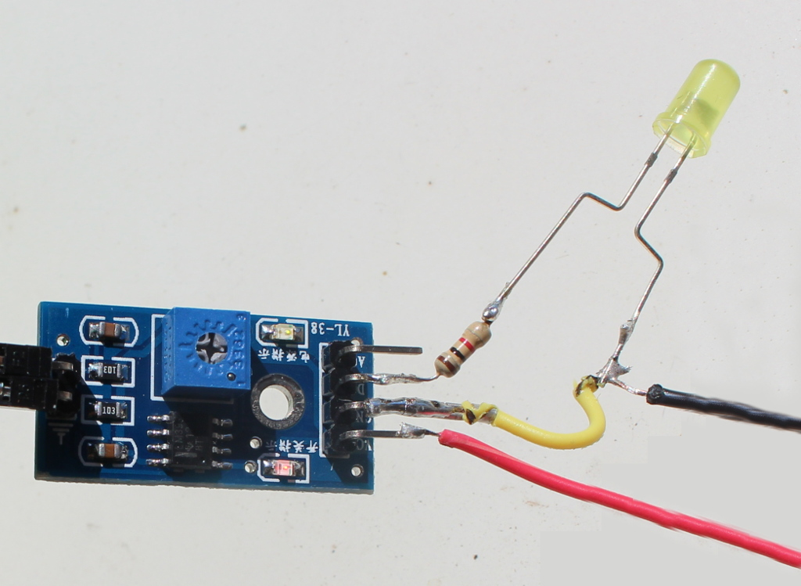
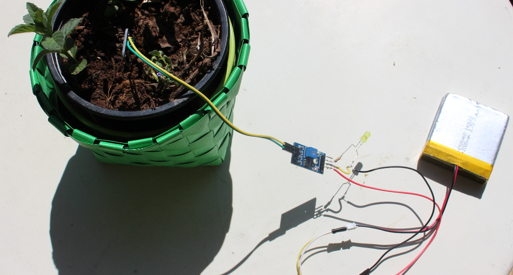

low budget humidity sensing
===========================
I tend to forget watering my plants, so I decided to create a own watering reminder.
I thought it would be fun so simply turn on a led, when the ground is too dry.
There are quite different soil meters which differ mostly in accuracy and current consumption.
For simplicity I'll stick with the one proposed by `tiago`_ as you can get it for around 1$ at `aliexpress`_ (in germany you wouldn't even get the wires for this price).

Sadly I could not find any English datasheet and as my Chinese is pretty bad, but the setup i really straight forward.
There is a VCC and GND pin which have to be connected as always. Additionally there is a A0 pin for analog output, and D0 for digital output.
For plotting graphs and stuff we need the analog output, but as I only want to turn on a light the D0 is enough.
D0 turns HIGH as soon as a threshold is exceeded.

So what i actually did is powering the sensor via a lithium-polymer battery with 3.7V, soldering a 1k resistor between D0 and the LED's +.
With this setup the light turns on when the threshold is exceeded. The threshold can be configured by rotating the blue screw. 

.. _tiago: http://www.tiagoespinha.net/2014/05/project-how-to-easily-monitor-your-plants-soil-humidity/#more-689
.. _aliexpress: http://www.aliexpress.com/item/R1B1-Soil-Hygrometer-Humidity-Detection-Module-Moisture-Water-Sensor-for-Arduino/1527477144.html

.. author:: default
.. categories:: none
.. tags:: none
.. comments::
